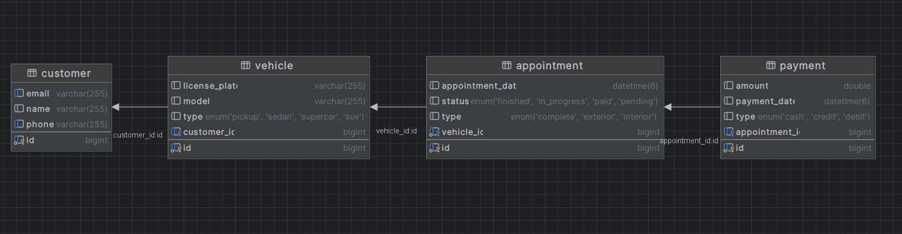

# HyperClean
A car wash exercise made as a code challenge for MuniDigital

### If you want to run it,
Execute `launch.sh`, it will create the containers, setup the database and start the backend


## The database
It's a MySQL database and has the following structure:



| Table | Fields | Relations |
| :--: | --- | --- |
| Customer   | id, name, email, phone                      | -                                |
| Vehicle    | id, license_plate, model, type, customer_id | `N:1` Customer (customer_id)    |
| Appointment | id, appointment_date, status, type, vehicle_id | `N:1` Vehicle (vehicle_id)      |
| Payment    | id, amount, payment_date, type, appointment_id | `1:1` Appointment (appointment_id) |
### Notes:
- The entities inside the application share the same structure.

### Enum Values:
- **VehicleType**: `PICKUP`, `SEDAN`, `SUV`, `SUPERCAR`
- **AppointmentType**: `EXTERIOR`, `INTERIOR`, `COMPLETE`
- **AppointmentStatus**: `PENDING`, `IN_PROGRESS`, `FINISHED`, `PAID`
- **PaymentType**: `CASH`, `CREDIT`, `DEBIT` (Only `CASH` is implemented as required)

The API is divided into four categories, CUSTOMER, VEHICLE, APPOINTMENT, PAYMENT

--------------
# The endpoints


> Wanna try it yourself? [Download HyperClean.postman_collection.json](https://github.com/Juli-CVidal/HyperClean/blob/main/docs/HyperClean.postman_collection.json)

# Customer (api/v1/customer)
## POST(/)
 Allows the creation of a customer

### Body Structure
```
{
  "name": "string",
  "email": "string",
  "phone": "string",
}
```


## GET (/)
Returns all the customers


## GET (/{id})
Searches for a customer based on the id


## GET by email (/by-email?email)
Searches for a customer based on the email


## GET by phone (/by-phone?phone)
Searches for a customer based on the phone


# Vehicle (api/v1/vehicle)
## POST(/)
 Allows the creation of a vehicle

### Body Structure
```
{
  "model": "string",
  "licensePlate": "string",
  "customerId": "number",
  "vehicleType": "VehicleType"
}
```


## GET (/{id})
Searches for a vehicle based on the id


## GET by customer id (/by-customer/{customerId})
Searches for the vehicles of a customer


## PUT assign to customer (/{id}/assign-to-customer/{customerId})
Assigns the vehicle to a customer


# Appointment (api/v1/appointment)
## POST(/)
 Allows the creation of an appointment

### Body Structure
```
{
  "appointmentDate": "string", // Format dd-MM-yyyy HH:mm:ss
  "status": "AppointmentStatus",
  "serviceType": "ServiceType",
  "vehicleId": "number"
}
```


## GET (/{id})
Searches for an appointment using id


## GET by vehicle (/by-vehicle/{vehicleId})
Searches for appointments of a vehicle


## PUT (/{id}/mark-as-in-progress)
Allows to mark an appointment as in progress


## PUT (/{id}/mark-as-finished)
Allows to mark an appointment as finished


# Payment (api/v1/payment)
## POST(/)
 Allows the creation of a payment

### Body Structure
```
{
  "amount": "number",
  "paymentDate": "String", // Format dd-MM-yyyy HH:mm:ss
  "type": "PaymentType",
  "appointmentId": "number"
}
```

> Note that this flow also mark the appointment as paid, if applicable

## GET (/{id})
Searches for an appointment using id


## GET by appointment id(/by-appointment/{appointmentId})
Searches for an appointment using id

